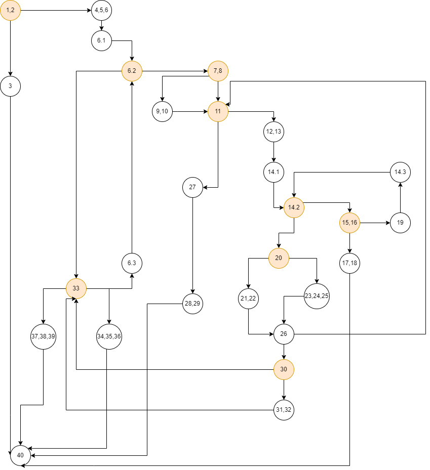

Втора лабораториска вежба по софтверско инженерство

Софија Китановиќ, бр. на индекс 223041

2) Control Flow Graph

3) Цикломатска комплексност
Цикломатската комплексност на кодот е 10 и се пресметува така што се бројат сите предикатни јазли и се додава +1.
Бр. на предикатни јазли = 9
